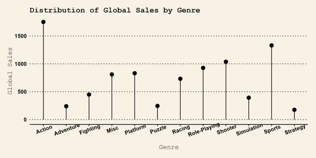

# R-Charts
  
Repository created to store charts made with the R language.  
Some of the charts I wasn't familiar with, so I can't guarantee they're all accurate, but I enjoyed creating them.  
The "gif.py" file was created to make the charts gif.  
I was inspired by [Cheatsheet 70+ ggplot Charts 📊](https://www.kaggle.com/code/akhabash/cheatsheet-70-ggplot-charts)  
I was also helped by ChatGPT to help me with the charts and python script.
## Datasets:
- [Bank Customer Churn Prediction](https://www.kaggle.com/datasets/shubhammeshram579/bank-customer-churn-prediction)
- [CO2 emissions](https://www.kaggle.com/datasets/koustavghosh149/co2-emission-around-the-world)
- [Cosmetics](https://www.kaggle.com/datasets/kingabzpro/cosmetics-datasets)
- [Global Video Game Sales](https://www.kaggle.com/datasets/thedevastator/global-video-game-sales)
- [Iris Species](https://www.kaggle.com/datasets/uciml/iris)
- [Penguin Data](https://www.kaggle.com/datasets/parulpandey/palmer-archipelago-antarctica-penguin-data)
- [Planets](https://www.kaggle.com/datasets/iamsouravbanerjee/planet-dataset)
